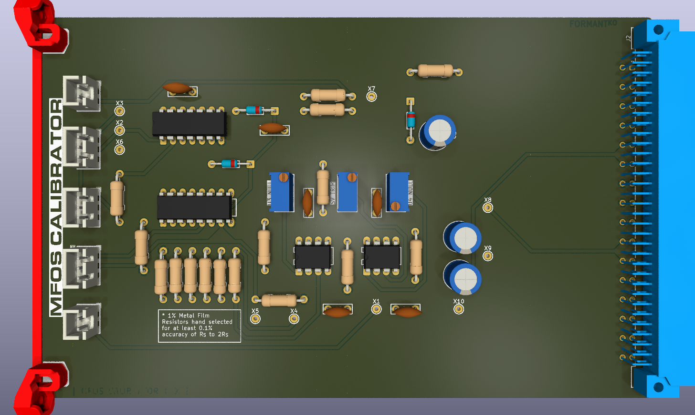
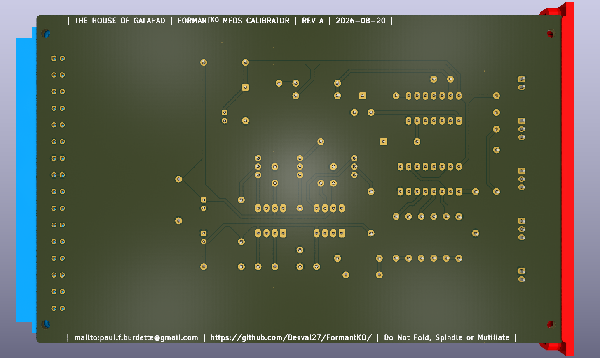

# MFOS CALIBRATOR

Volts-Per-Octave calibration tool featuring 0V-3V/0V-7V range with variable/manual cycling.

Format: 3U

## Status

⚠️ Untested⚠️

## Documents

- [MFOS Site (External Link)](https://musicfromouterspace.com/index.php?MAINTAB=SYNTHDIY&PROJARG=VPO_CALIBRATOR/VPO_CALIBRATOR.php)
- [Schematic](doc/schematic.pdf)
- [Assembly](doc/assembly.pdf)

## Gerber to Order

⚠️ Untested⚠️

- [Default](gerber_to_order/CALIBRATOR_160.0x100.0mm_for_Default.zip)
- [Elecrow](gerber_to_order/CALIBRATOR_160.0x100.0mm_for_Elecrow.zip)
- [FusionPCB](gerber_to_order/CALIBRATOR_160.0x100.0mm_for_FusionPCB.zip)
- [JLCPCB](gerber_to_order/CALIBRATOR_160.0x100.0mm_for_JLCPCB.zip)
- [PCBWay](gerber_to_order/CALIBRATOR_160.0x100.0mm_for_PCBWay.zip)

## Images

