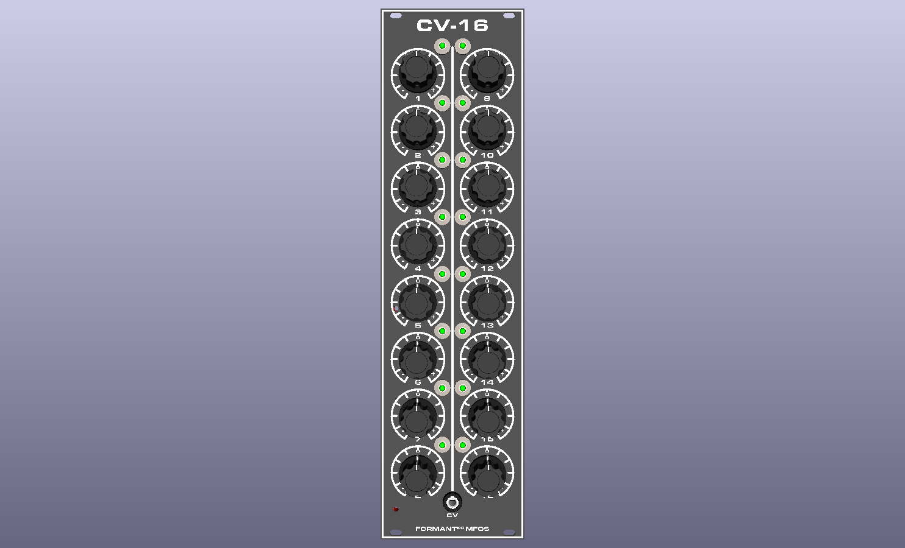
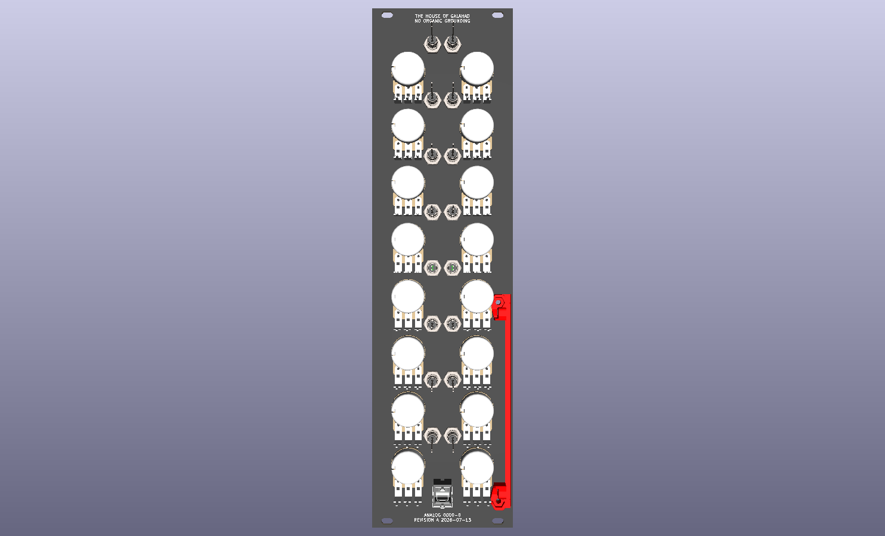

# ANALOG

CV-16

Format: 6U

## Status

⚠️ Incomplete⚠️

## Documents

- [Assembly](plots/ANALOG__Assembly.pdf)

## Gerber to Order

⚠️ Untested⚠️

- [Default](gerber_to_order/ANALOG_70.78x261.75mm_for_Default.zip)
- [Elecrow](gerber_to_order/ANALOG_70.78x261.75mm_for_Elecrow.zip)
- [FusionPCB](gerber_to_order/ANALOG_70.78x261.75mm_for_FusionPCB.zip)
- [JLCPCB](gerber_to_order/ANALOG_70.78x261.75mm_for_JLCPCB.zip)
- [PCBWay](gerber_to_order/ANALOG_70.78x261.75mm_for_PCBWay.zip)

## Images

