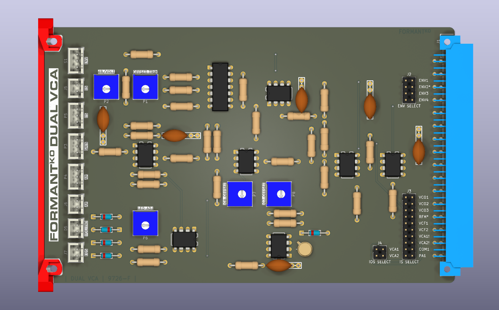

# Formant-KO 

# WIP
A somewhat authentic (at least in spirit) knockoff of the Elektor Formant™ DIY project synthesizer.  

Components that are not easily sourcable are substitued.  Substituted components or adapater boards are noted.

[Original Book 1 PDF](https://ikiwiki.laglab.org/Modular_Beast/ElektorFormantMusicSynthesiser.pdf)

DIN 41617 connecters are replaced with DIN 41612 connectors (Type B 32-PIN).  A backplane is included as part of the project to avoid the point-to-point backend wiring of the original.  However, the current backplane does not currently offer more configurability compared to the original.  It simply provides a secure connection and reduces wiring complexity and fragility.  

I have opted to keep the flying wires for connecting the panel components as opposed to a separate panel mounted "control" PCB.  Right now I'm torn between keeping the layouts and wiring as they were originally defined or replacing them with something like JST XH connectors for easy disconnect & replacement.  Perhaps both?

The goal for verison 2 is to make both the cards and the bus system more configurable compared to the original normaled path (e.g. jumpers for signal routing, etc.).

### What About the μA726?

Of course this part is in very short supply and often quite expensive when available.  However, at least for this iteration, the plan is to replicate the original design as closely as possible.  Not only will this allow original parts to be used but it will also permit available drop in replacements such as the [pA726](https://www.portabellabz.be/pa726.html). 

### A Note About Board Heights

The original Formant used two different PCB sizes.  These were Small (160mm x 100mm) and Large (160mm x 200mm).  The Small corresponds to the standard single height EuroCard, but the standard double height EuroCard is 160mm x 233.35mm. The latter being 33.35mm taller than the original.  This replica will use the double height EuroCard instead of the original Large.  This allows for eaiser usage of standard EuroCard cages and accessories.  

Note: All modules offer mounting support for typical Schroff EuroCard panel and rack accessories.

## Status

⚠️ Very Incomplete ⚠️

Note: This information is only as accurate as I can remember to update it.

Most activity has been in the COM, NOISE, and LFOs modules. Scratch that....most activity has been bits and pieces all over.  I like to switch things up.

Latest updates are for the [DUAL-VCA](modules/DUAL_VCA/README.md) module.

- ✓ PCB/Panel exists but likely a WIP.
- ✔ PCB/Panel exists but may not be completely functional.
- ✅ PCB/Panel exists and is working (for a given value of "working").

## Modules

- [TEMPLATE](modules/TEMPLATE/README.md)

### Book 1

- ✓ [KEYBOARD INTERFACE](modules/KBI/README.md)
- ✓ [KEYBOARD DIVIDER](modules/KB_DIV/README.md)
- ✓ [INTERFACE RECEIVER](modules/INTF_RCVR/README.md)
- ✓ [POWER SUPPLY](system/PSU/README.md)
- ✓ [POWER SUPPLY TRANSISTORS](system/PSU/PSU_PT/README.md)
- ✓ [VCO](modules/VCO/README.md)
- ✓ [VCF 12dB](modules/VCF_12/README.md)
- [VCF 24dB](modules/VCF_24/README.md)
- ✓ [RFM](modules/RFM/README.md)
- ✓ [ADSR](modules/ADSR/README.md)
- ✓ [DUAL VCA](modules/DUAL_VCA/README.md)
- [LFOs](modules/LFOs/README.md)
- ✓ [NOISE](modules/NOISE/README.md)
- ✓ [COM](modules/COM/README.md)

### Book 2

- [TOUCH CONTROLLER](modules/TOUCH_CONTROLLER/README.md)
- [NEW PITCH DETECTOR](modules/NPD/README.md)
- [DIGITAL KEYBOARD CONTROLLER](modules/DKC/README.md)
- [VCF EXTENSIONS](modules/VCF_EXT/README.md)
- ✓ [LFO SINE CONVERTER](modules/LFO_SINE/README.md)
- ✓ [NOISE DNG](modules/NOISE_DNG/README.md)
- ✓ [NOISE CNC](modules/NOISE_CNC/README.md)
- [COM EXTENSIONS](modules/COM_EXT/README.md)
- ✓ [RING MODULATOR](modules/RING_MODULATOR/README.md)
- ✓ [PHASE SHIFTER](modules/PHASE_SHIFTER/README.md)
- [KRIMISIZER](modules/KRIMISIZER/README.md)
- [DIGITAL REVERB](modules/DIGITAL_REVERB/README.md)
- [POWER SUPPLIES](modules/POWER_SUPPLIES/README.md)
- [KOV KB-GATE DISTRIBUTION](modules/KOV_KB_GATE_DISTRIBUTION/README.md)
- [MULTIPLE JACKS](modules/MULTIPLE_JACKS/README.md)
- [ADSR CONTROLLER](modules/ADSR_CONTROLLER/README.md)
- [VC LFOs](modules/VC_LFOs/README.md)
- [LF VCO](modules/LF_VCO/README.md)
- [DNG](modules/DNG/README.md)
- [ENV FOLLOWER](modules/ENV_FOLLOWER/README.md)
- ✔ [SAMPLE & HOLD](modules/SAMPLE_AND_HOLD/README.md)
- ✓ [WAVEFORM-PROCESSOR](modules/WAVEFORM_PROCESSOR/README.md)
- [MIXER](modules/MIXER/README.md)
- ✓ [TUNING](modules/TUNING/README.md)
- [SEQUENCER](modules/SEQUENCER/README.md)

## Panels

- [TEMPLATE_3U](panels/TEMPLATE_3U/README.md)
- [TEMPLATE_6U](panels/TEMPLATE_6U/README.md)

### Book 1

- ✓ [VCO](panels/VCO/README.md)
- ✓ [VCF-12](panels/VCF_12/README.md)
- ✓ [VCF-24](panels/VCF_24/README.md)
- ✓ [RFM](panels/RFM/README.md)
- ✓ [ADSR](panels/ADSR/README.md)
- ✓ [DUAL_VCA](panels/DUAL_VCA/README.md)
- [LFOs](panels/LFOs/README.md)
- ✓ [NOISE](panels/NOISE/README.md)
- ✓ [COM](panels/COM/README.md)

### Book 2

- ✓ [RING MODULATOR](panels/RING_MODULATOR/README.md)
- ✓ [PHASE SHIFTER](panels/PHASE_SHIFTER/README.md)
- ✓ [MULTIPLE JACKS 3U](panels/MULTIPLE_JACKS_3U/README.md)
- ✓ [MULTIPLE JACKS 6U](panels/MULTIPLE_JACKS_6U/README.md)
- [DNG](panels/DNG/README.md)
- [ENVELOPE FOLLOWER](panels/ENVELOPE_FOLLOWER/README.md)
- [WAVEFORM PROCESSOR](panels/WAVEFORM_PROCESSOR/README.md)
- [MIXER 3](panels/MIXER_3/README.md)
- ✓ [TUNING](panels/TUNING/README.md)

## System

- ✓ [BACKPLANE A](system/BACKPLANE_A/README.md)
- ✅ [TEST BOARD](system/TEST_HARNESS/README.md)
- ✓ [CARD EXTENDER](system/CARD_EXTENDER/README.md)
- ✓ [µA726C TESTER](system/VALIDATOR_JIG/README.md)

## Modular Sequencer Side Quest 

Based on MFOS 16-step Analog Sequencer
[MFOS Project](https://musicfromouterspace.com/index.php?MAINTAB=SYNTHDIY&PROJARG=SEQ16_2006/SEQ16_2006.php)

### Modules

- [CLOCK](sequencer/modules/CLOCK/README.md)
- [ANALOG CV-16](sequencer/modules/ANALOG/README.md)

### Panels

- [CLOCK](sequencer/panels/CLOCK/README.md)
- [ANALOG CV-16](sequencer/panels/ANALOG/README.md)

## ⚠️ Disclaimer⚠️

This project is provided **"as is"**, without warranty of any kind, express or implied,
including but not limited to the warranties of merchantability, fitness for a
particular purpose, and noninfringement.

This is a DIY electronics project intended for educational and experimental use.
Use at your own risk.

The author assumes **no responsibility or liability** for any damage, injury, or loss
resulting from the use or misuse of this design, including but not limited to:

* Damage to connected equipment (Eurorack modules, power supplies, computers, etc.)
* Incorrect assembly or wiring
* Use with incompatible voltages or signal levels
* Personal injury

### Electrical Safety

This project may interface with:

* ±15V Power rails
* AC Mains Power (Lethal Risk)
* External control voltages (CV)
* Digital and analog circuitry

Improper handling may result in damage or unsafe conditions.

You are responsible for:

* Verifying all connections before powering the system
* Ensuring correct polarity of power connections
* Confirming voltage ranges and signal compatibility
* Using appropriate protection circuits where necessary

### No Guarantees

Schematics, PCB layouts, and code are provided for reference only.
They may contain errors, omissions, or design flaws.

**Always review and validate the design before building or using it.**
