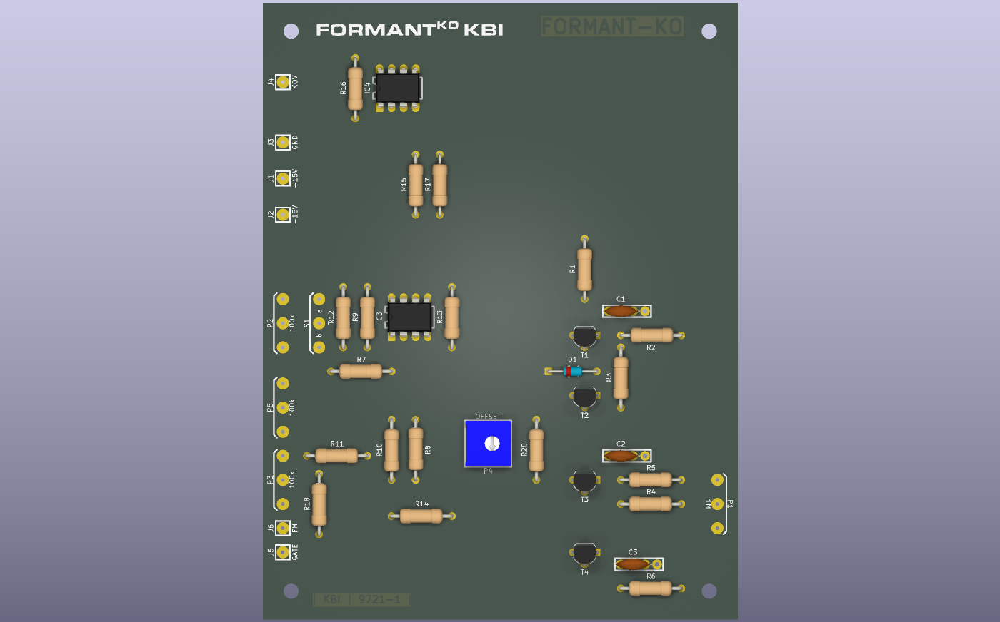
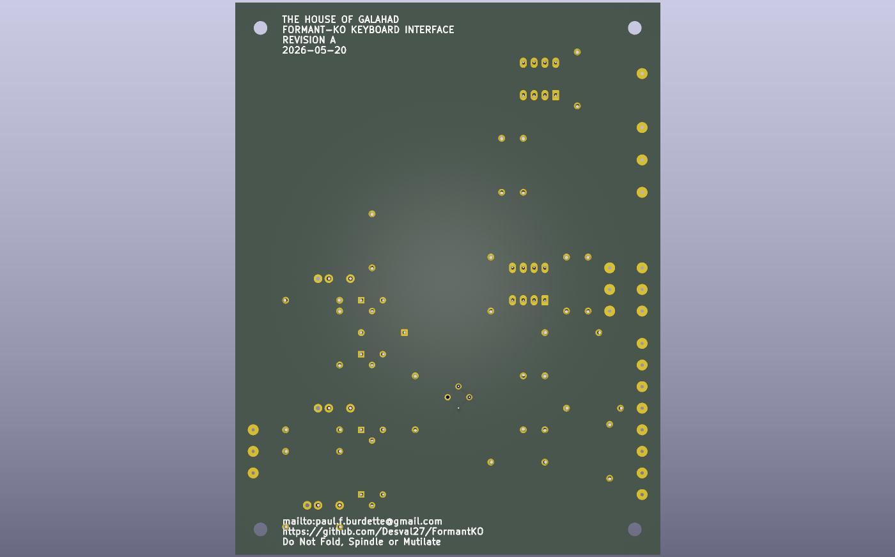

# STATUS

0% Complete

- [ ] Schematic
- [ ] Schematic Additions
- [ ] Schematic Review
- [ ] PCB Placement
- [ ] PCB Routing
- [ ] PCB Review
- [ ] Sample
- [ ] Build
- [ ] Calibrated
- [ ] Tested

