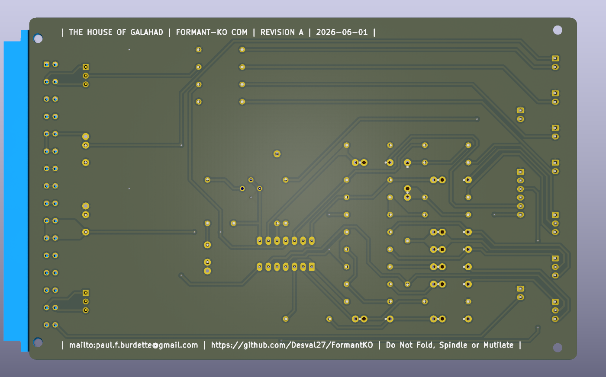

# COM

## Status

60% Complete

- [x] Schematic
- [x] Schematic Additions
- [x] Schematic Review
- [x] PCB Placement
- [x] PCB Routing
- [x] PCB Review
- [ ] Sample
- [ ] Build
- [ ] Calibrated
- [ ] Tested

## Documents

- [Assembly](plots/COM__Assembly.pdf)
- [Interactive Bill of Materials](bom/ibom.html)

## Gerber to Order

!Untested!

- [Default](gerber_to_order/COM_160.0x100.0mm_for_Default.zip)
- [Elecrow](gerber_to_order/COM_160.0x100.0mm_for_Elecrow.zip)
- [FusionPCB](gerber_to_order/COM_160.0x100.0mm_for_FusionPCB.zip)
- [JLCPCB](gerber_to_order/COM_160.0x100.0mm_for_JLCPCB.zip)
- [PCBWay](gerber_to_order/COM_160.0x100.0mm_for_PCBWay.zip)

## Images

