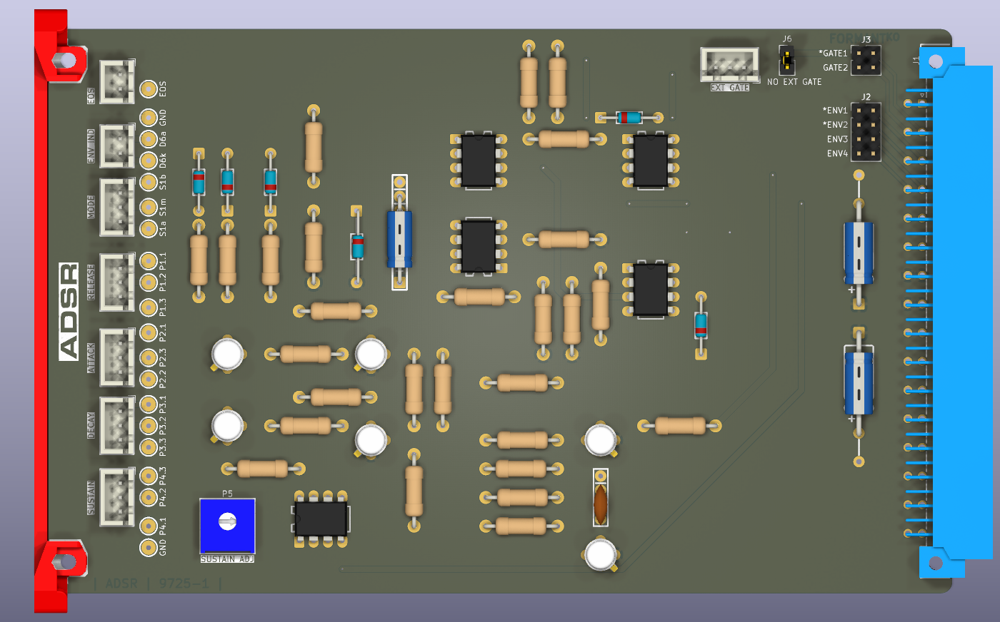
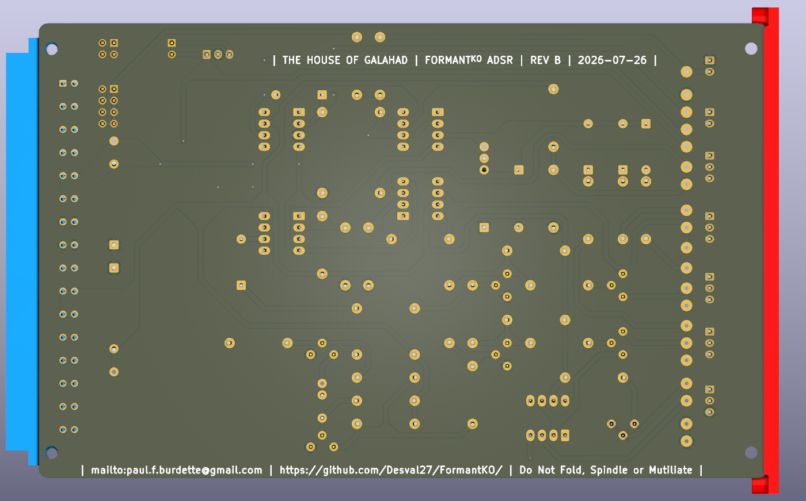

# ADSR

Format: 3U

### Modifications

- Add external gate input.  This is normalized and will disconnect any existing internal gate bus assignment.
- Added jumper to completly disable the external gate path.  With the jumper in place the gate I/O functions the same as the original design.

## Status

⚠️ Untested⚠️

## Documents

- [Schematic](doc/schematic.pdf)
- [Assembly](doc/assembly.pdf)
- [Bill of Materials](doc/bom.csv)
- [Interactive Bill of Materials](doc/ibom.html)

## Gerber to Order

⚠️ Untested⚠️

- [Default](gerber_to_order/ADSR_160.0x100.0mm_for_Default.zip)
- [Elecrow](gerber_to_order/ADSR_160.0x100.0mm_for_Elecrow.zip)
- [FusionPCB](gerber_to_order/ADSR_160.0x100.0mm_for_FusionPCB.zip)
- [JLCPCB](gerber_to_order/ADSR_160.0x100.0mm_for_JLCPCB.zip)
- [PCBWay](gerber_to_order/ADSR_160.0x100.0mm_for_PCBWay.zip)

## Images

