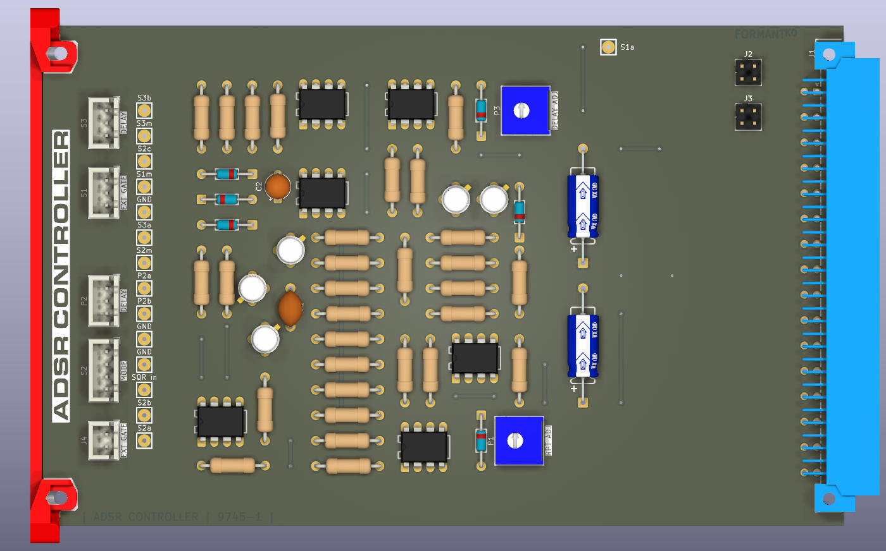
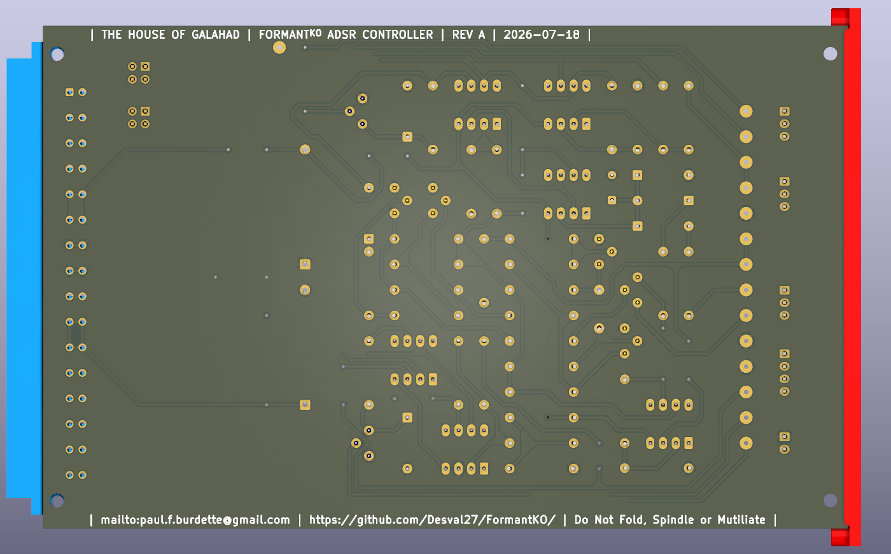

# ADSR CONTROLLER

Format: 3U

The ADSR Controller expands the capabilities of the standard Formant ADSR module by adding clock-driven repeat and delayed triggering functions. An external square-wave clock source (typically an LFO or VC-LFO) can repeatedly retrigger the envelope, enabling rhythmic modulation and gated effects. Repeat operation may be disabled, run continuously (Auto), or only while an external or keyboard gate is active. An adjustable delay function can also postpone envelope triggering, making the module useful for creating delayed attacks, repeating envelopes, and more complex modulation patterns.

## Status

⚠️ Incomplete⚠️

## Documents

- [English Translation](ADSR_CONTROLLER__en.pdf)
<!--
- [Schematic](plots/ADSR_CONTROLLER__Schematic.pdf)
- [Assembly](plots/ADSR_CONTROLLER__Assembly.pdf)
-->

## Gerber to Order

⚠️ Untested⚠️

## Images

