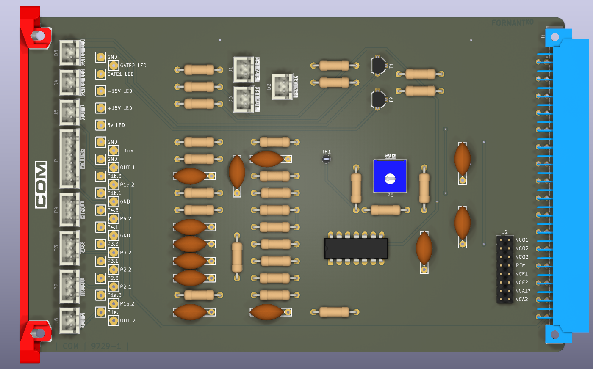
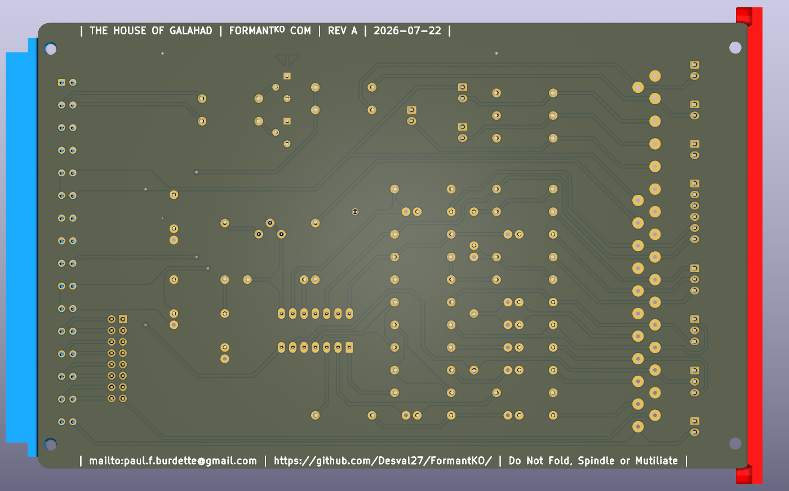

# COM

Format: 3U

### Modifications

- Change power & gate leds to not require the interface receiver board.
- Use transistor drivers for both gate LEDs.
- Add Gate2 LED and associated tranistor driver.

## Status

⚠️ Untested⚠️

## Documents

- [Schematic](plots/COM__Schematic.pdf)
- [Assembly](plots/COM__Assembly.pdf)
- [Bill of Materials](bom/bom.csv)
- [Interactive Bill of Materials](bom/ibom.html)

## Gerber to Order

⚠️ Untested⚠️

- [Default](gerber_to_order/COM_160.0x100.0mm_for_Default.zip)
- [Elecrow](gerber_to_order/COM_160.0x100.0mm_for_Elecrow.zip)
- [FusionPCB](gerber_to_order/COM_160.0x100.0mm_for_FusionPCB.zip)
- [JLCPCB](gerber_to_order/COM_160.0x100.0mm_for_JLCPCB.zip)
- [PCBWay](gerber_to_order/COM_160.0x100.0mm_for_PCBWay.zip)

## Images

