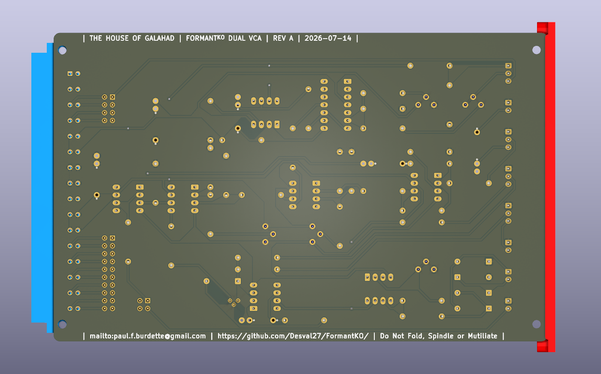

# DUAL-VCA

Format: 3U

### Modifications

None.  Yet.

## Status

⚠️ Untested⚠️

## Documents

- [Schematic](plots/DUAL_VCA__Schematic.pdf)
- [Assembly](plots/DUAL_VCA__Assembly.pdf)
- [Interactive Bill of Materials](bom/ibom.html)

## Gerber to Order

⚠️ Untested⚠️

- [Default](gerber_to_order/DUAL_VCA_160.0x100.0mm_for_Default.zip)
- [Elecrow](gerber_to_order/DUAL_VCA_160.0x100.0mm_for_Elecrow.zip)
- [FusionPCB](gerber_to_order/DUAL_VCA_160.0x100.0mm_for_FusionPCB.zip)
- [JLCPCB](gerber_to_order/DUAL_VCA_160.0x100.0mm_for_JLCPCB.zip)
- [PCBWay](gerber_to_order/DUAL_VCA_160.0x100.0mm_for_PCBWay.zip)

## Images

