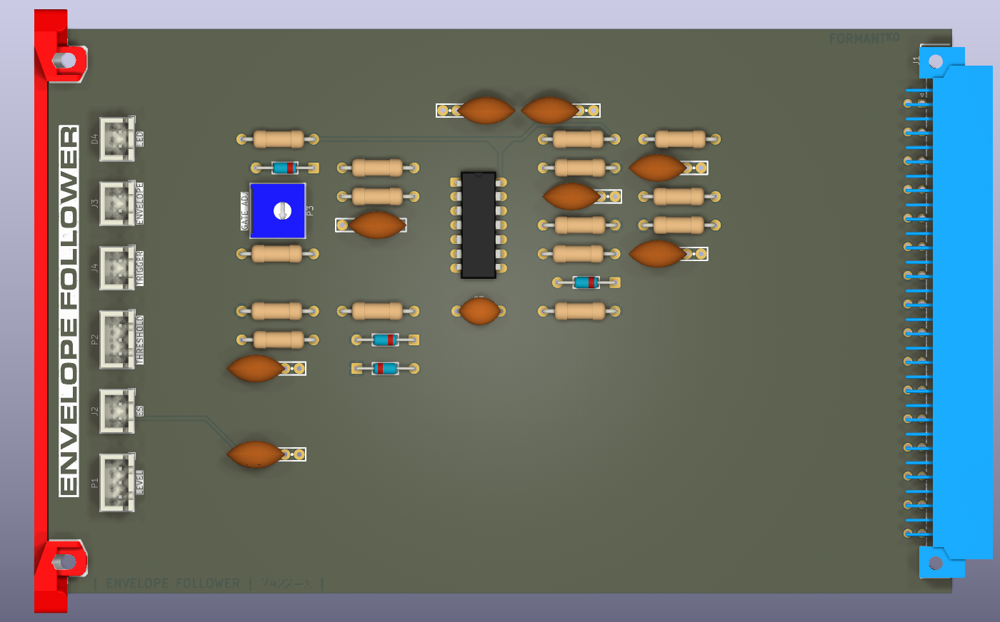
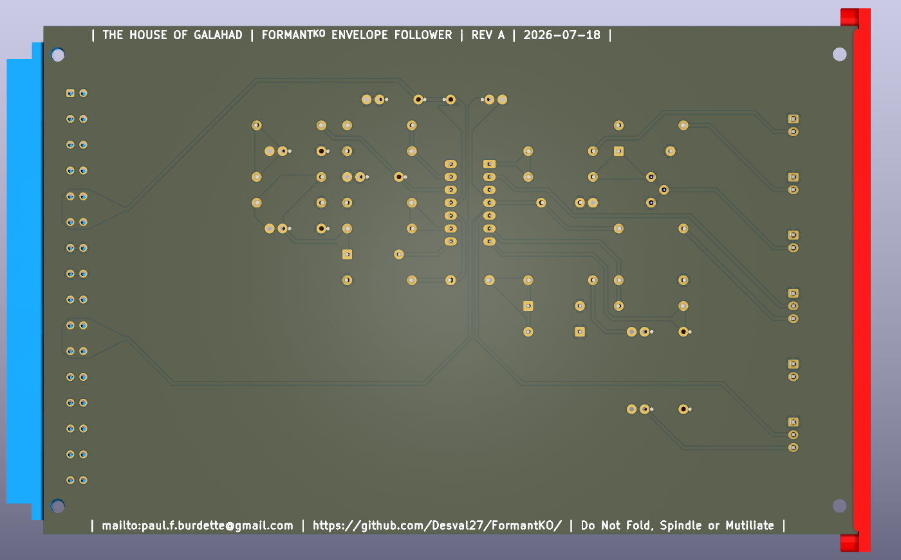

# ENVELOPE FOLLOWER

Format: 3U

The Envelope Follower converts an incoming audio signal into control voltages that can be used to modulate other synthesizer modules. It accepts microphone, guitar, or line-level signals, with an adjustable input gain to accommodate a wide range of sources. The module extracts the amplitude envelope of the audio and generates a proportional control voltage (CV), allowing dynamics such as playing intensity or volume changes to control filters, VCAs, oscillators, or other destinations. A separate threshold control produces a gate output whenever the input level exceeds the selected level, making it possible to trigger envelopes, sequencers, or other event-driven modules directly from an audio signal.

## Status

⚠️ Untested⚠️

## Documents

- [English Translation](ENVELOPE_FOLLOWER__en.pdf)
- [Schematic](plots/ENVELOPE_FOLLOWER__Schematic.pdf)
- [Assembly](plots/ENVELOPE_FOLLOWER__Assembly.pdf)
- [Interactive Bill of Materials](bom/ibom.html)

## Gerber to Order

⚠️ Untested⚠️

- [Default](gerber_to_order/ENVELOPE_FOLLOWER_160.0x100.0mm_for_Default.zip)
- [Elecrow](gerber_to_order/ENVELOPE_FOLLOWER_160.0x100.0mm_for_Elecrow.zip)
- [FusionPCB](gerber_to_order/ENVELOPE_FOLLOWER_160.0x100.0mm_for_FusionPCB.zip)
- [JLCPCB](gerber_to_order/ENVELOPE_FOLLOWER_160.0x100.0mm_for_JLCPCB.zip)
- [PCBWay](gerber_to_order/ENVELOPE_FOLLOWER_160.0x100.0mm_for_PCBWay.zip)

## Images

