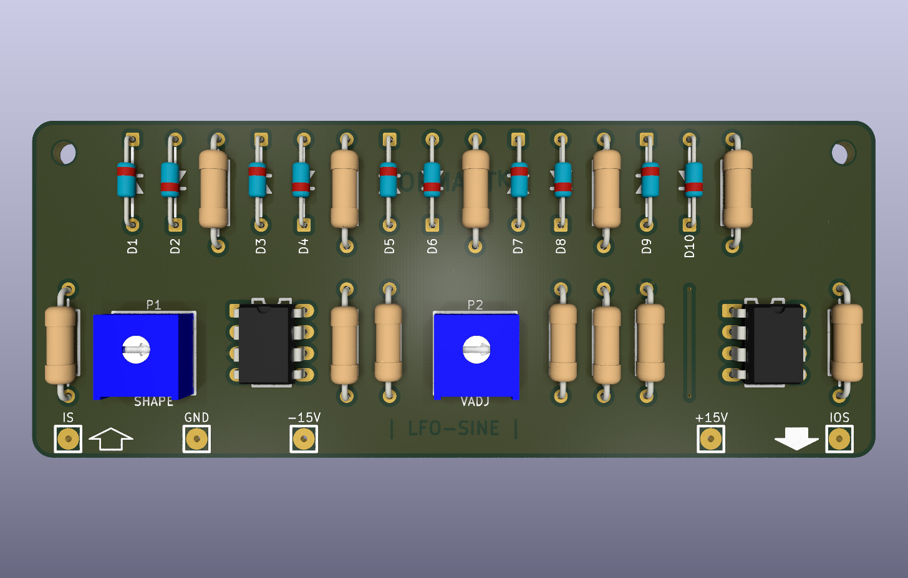
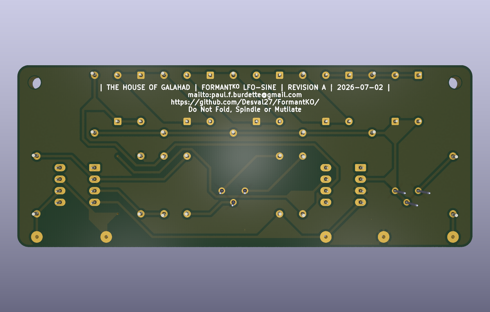

# LFO-SINE

## Status

⚠️ Untested ⚠️

## Documents

- [Translated Document](LFO_SINE_translated.pdf)
- [Schematic](LFO_SINE_schematic.pdf)
- [Assembly](plots/LFO_SINE__Assembly.pdf)
- [Interactive Bill of Materials](bom/ibom.html)

## Gerber to Order

⚠️ Untested ⚠️

- [Default](gerber_to_order/LFO_SINE_100.0x40.0mm_for_Default.zip)
- [Elecrow](gerber_to_order/LFO_SINE_100.0x40.0mm_for_Elecrow.zip)
- [FusionPCB](gerber_to_order/LFO_SINE_100.0x40.0mm_for_FusionPCB.zip)
- [JLCPCB](gerber_to_order/LFO_SINE_100.0x40.0mm_for_JLCPCB.zip)
- [PCBWay](gerber_to_order/LFO_SINE_100.0x40.0mm_for_PCBWay.zip)

## Images

