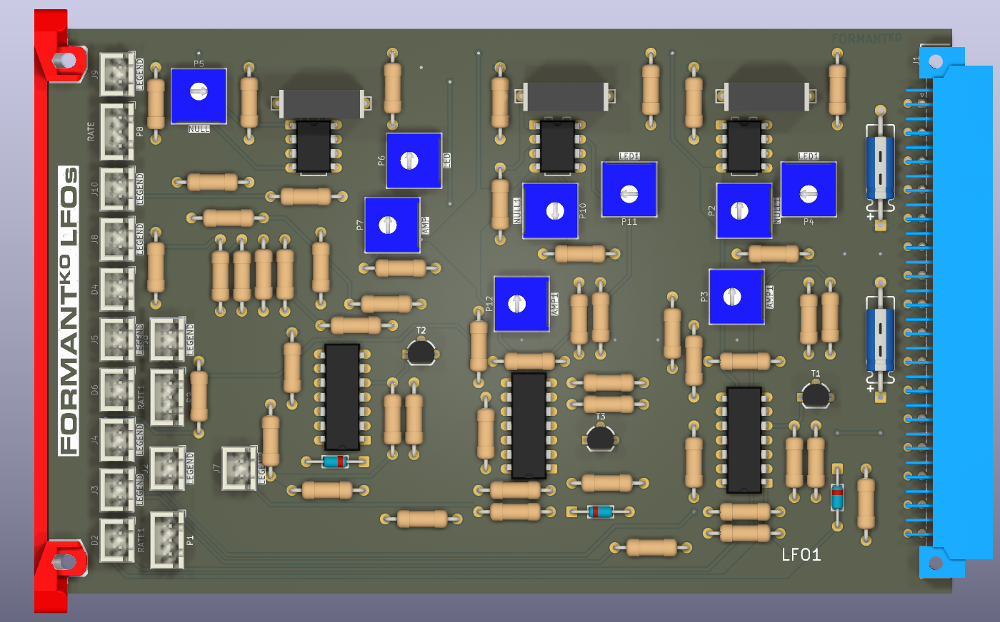
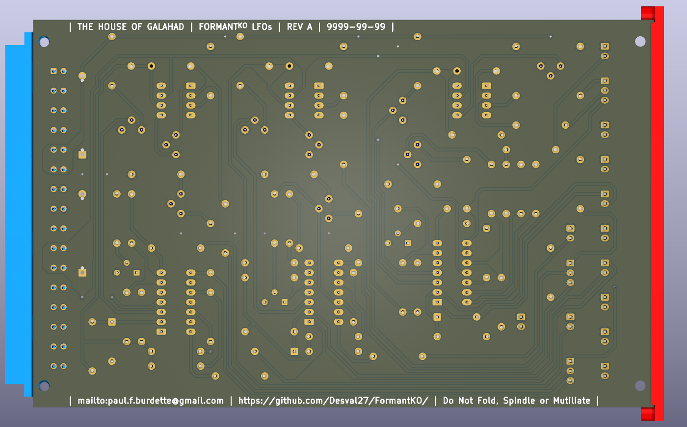

# LFOs

Format: 3U

### Modifications

None

## Status

⚠️ Incomplete⚠️

## Documents

<!--
- [Schematic](plots/ADSR__schematic.pdf)
- [Assembly](plots/ADSR__Assembly.pdf)
- [Interactive Bill of Materials](bom/ibom.html)
-->

## Gerber to Order

<!--
⚠️ Untested⚠️
-->

## Images

