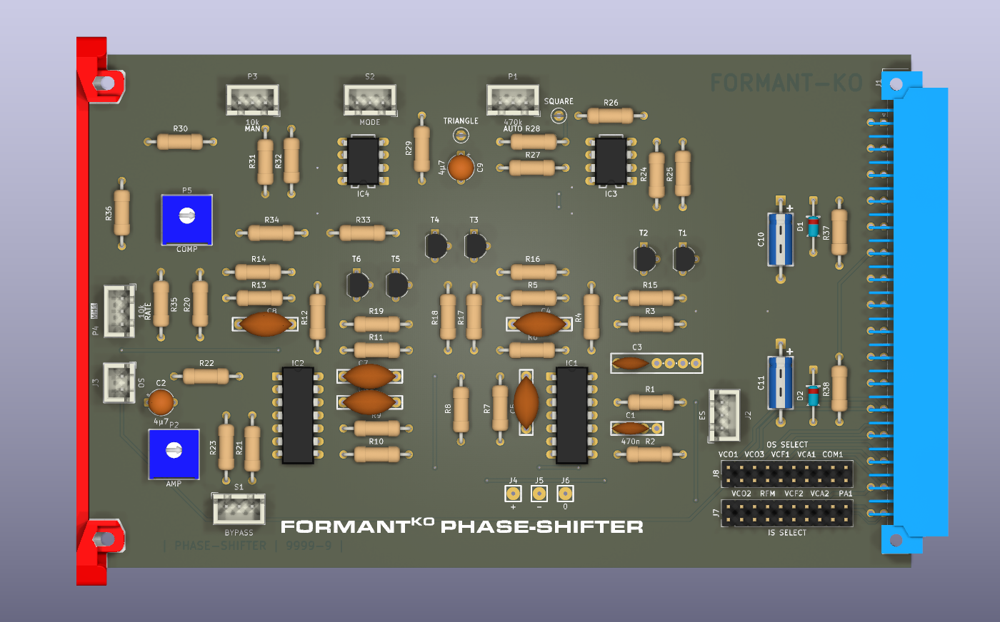
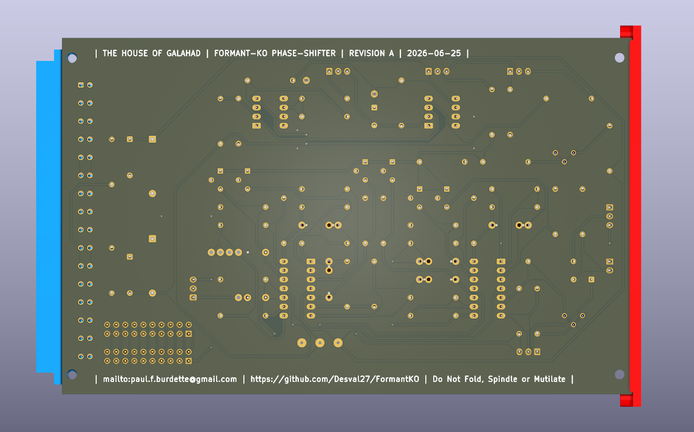

# PHASE-SHIFTER

## STATUS

⚠️ Untested ⚠️

### Modifications

- Both IS and IOS are optionally bus assignable. Beware of loopback assignments.
- IS is normalized to ES.  Plugging anything into the ES jack breaks that normalization.
- Regardless of IOS selection EOS is always present at the jack.

## Documents

- [Translated Source](PHASE_SHIFTER_translated.pdf)
- [Schematic](PHASE_SHIFTER.pdf)
- [Assembly](plots/PHASE_SHIFTER__Assembly.pdf)
- [Interactive Bill of Materials](bom/ibom.html)

## Gerber to Order

⚠️ Untested ⚠️

- [Default](gerber_to_order/PHASE_SHIFTER_160.0x100.0mm_for_Default.zip)
- [Elecrow](gerber_to_order/PHASE_SHIFTER_160.0x100.0mm_for_Elecrow.zip)
- [FusionPCB](gerber_to_order/PHASE_SHIFTER_160.0x100.0mm_for_FusionPCB.zip)
- [JLCPCB](gerber_to_order/PHASE_SHIFTER_160.0x100.0mm_for_JLCPCB.zip)
- [PCBWay](gerber_to_order/PHASE_SHIFTER_160.0x100.0mm_for_PCBWay.zip)

## Images

