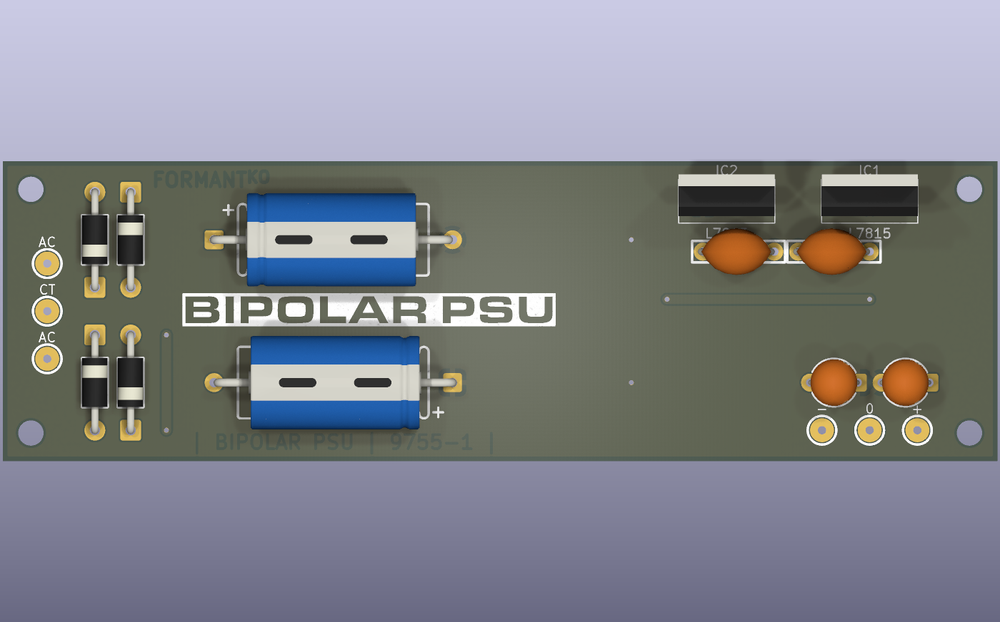
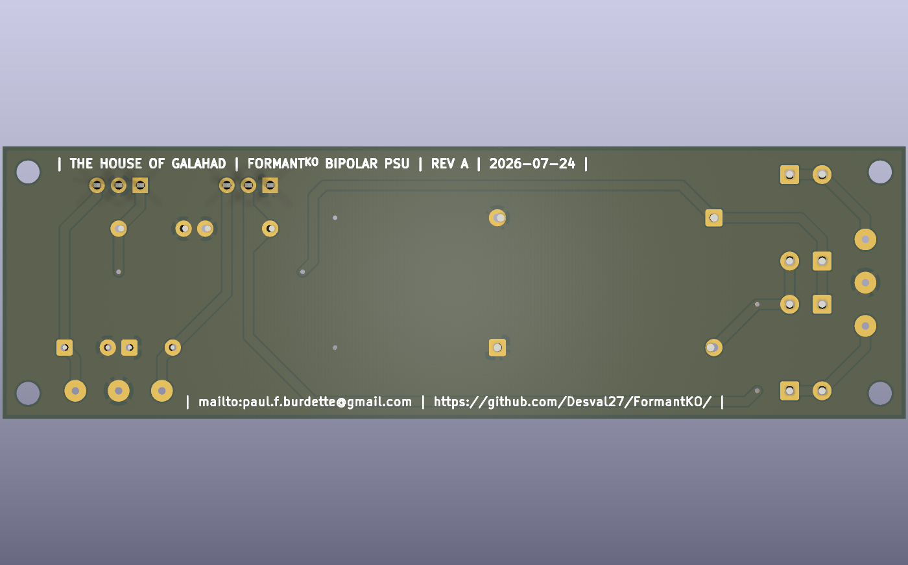
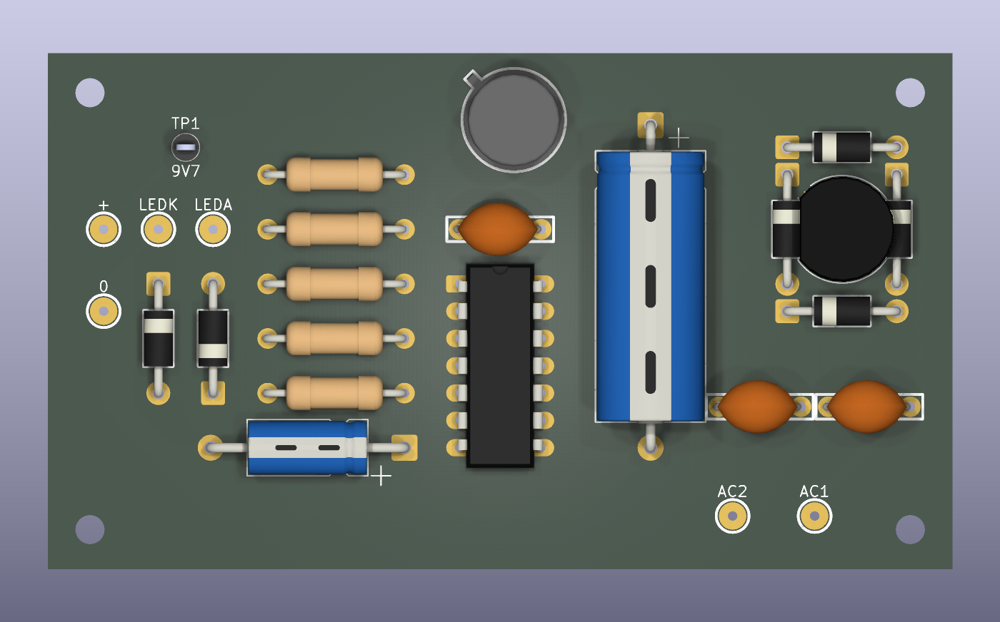
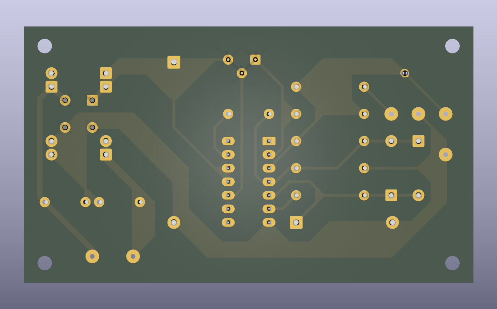

# POWER SUPPLIES

Format: Multiple

## Status

⚠️Incomplete⚠️

## Documents

- [English Translation](doc/POWER_SUPPLIES__en.pdf)

### Bipolar Power Supply

- [Assembly](BIPOLAR_PSU/doc/assembly.pdf)
- [Schematic](BIPOLAR_PSU/doc/schematic.pdf)
- [Bill of Materials](BIPOLAR_PSU/doc/bom.csv)
- [Interactive Bill of Materials](BIPOLAR_PSU/doc/ibom.html)

### 9V Power Supply

## Gerber to Order

⚠️Untested⚠️

### Bipolar Power Supply

- [Default](BIPOLAR_PSU/gerber_to_order/BIPOLAR_PSU_106.0x32.0mm_for_Default.zip)
- [Elecrow](BIPOLAR_PSU/gerber_to_order/BIPOLAR_PSU_106.0x32.0mm_for_Elecrow.zip)
- [FusionPCB](BIPOLAR_PSU/gerber_to_order/BIPOLAR_PSU_106.0x32.0mm_for_FusionPCB.zip)
- [JLCPCB](BIPOLAR_PSU/gerber_to_order/BIPOLAR_PSU_106.0x32.0mm_for_JLCPCB.zip)
- [PCBWAY](BIPOLAR_PSU/gerber_to_order/BIPOLAR_PSU_106.0x32.0mm_for_PCBWay.zip)

### 9V Power Supply

## Images

