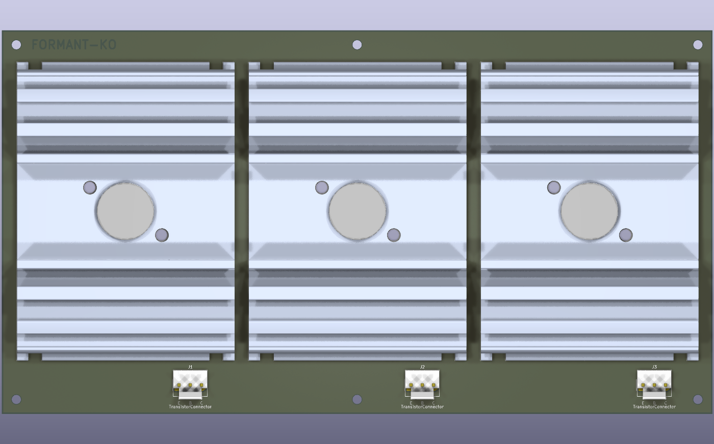
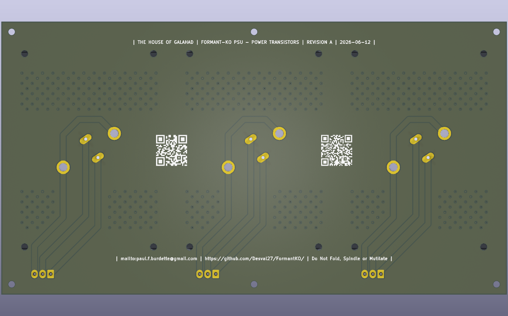

# POWER SUPPLY - POWER TRANSISTORS

## Status

⚠️ Incomplete⚠️

0% Complete

- [x] Schematic
- [ ] Schematic Additions
- [x] Schematic Review
- [x] PCB Placement
- [x] PCB Routing
- [ ] PCB Review
- [ ] Sample
- [ ] Build
- [ ] Calibrated
- [ ] Tested

## Documents

## Interactive Bill of Materials

## Gerber to Order

## Images

