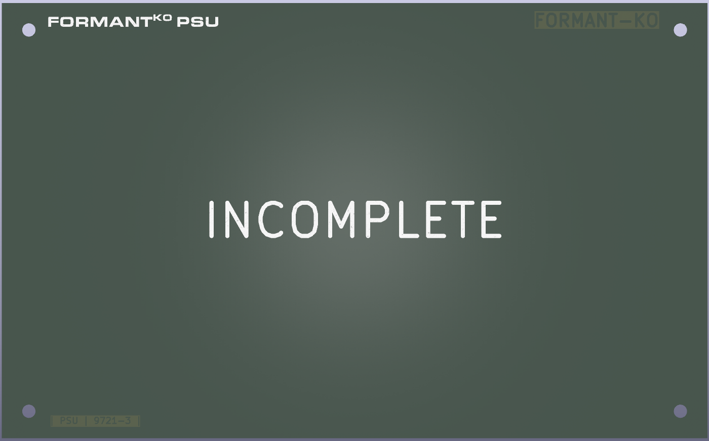

# POWER SUPPLY

## Status

⚠️ Incomplete⚠️

## Additional Resources

- [POWER TRANSISTORS](PSU_PT/README.md)

## Documents

- [Schematic](PSU.pdf)
- [Assembly](plots/PSU__Assembly.pdf)
- [Interactive Bill of Materials](bom/ibom.html)

## Gerber to Order

⚠️ Untested⚠️

- [Default](gerber_to_order/PSU_177.800001x113.03mm_for_Default.zip)
- [Elecrow](gerber_to_order/PSU_177.800001x113.03mm_for_Elecrow.zip)
- [FusionPCB](gerber_to_order/PSU_177.800001x113.03mm_for_FusionPCB.zip)
- [JLCPCB](gerber_to_order/PSU_177.800001x113.03mm_for_JLCPCB.zip)
- [PCBWay](gerber_to_order/PSU_177.800001x113.03mm_for_PCBWay.zip)

## Images

