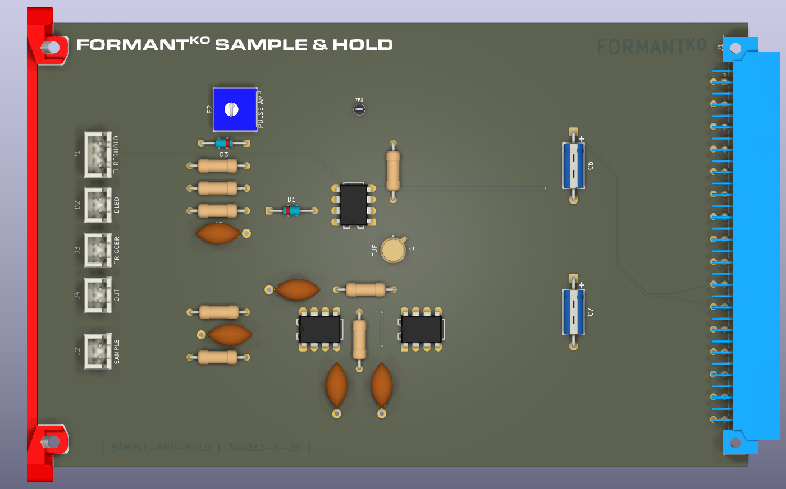
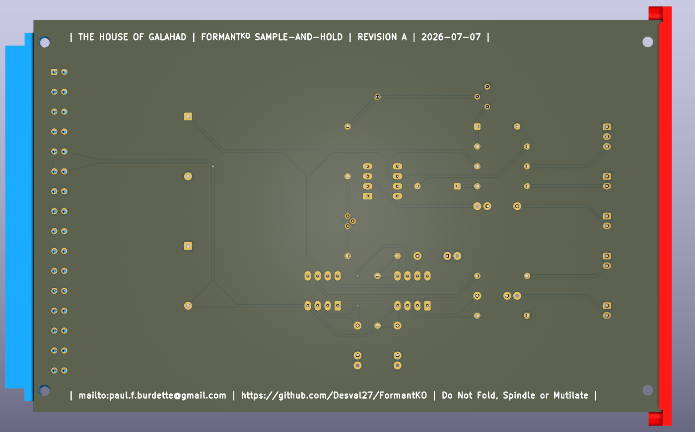

# Sample & Hold

## Status

⚠️ Untested ⚠️

Revision A

## Documents

- [English Translation](SAMPLE_AND_HOLD_en.pdf)
- [Schematic](plots/SAMPLE_AND_HOLD__schematic.pdf)
- [Assembly](plots/SAMPLE_AND_HOLD__Assembly.pdf) 
- [Interactive Bill of Materials](bom/ibom.html)

## Gerber to Order

⚠️ Untested ⚠️
- [Default](gerber_to_order/SAMPLE_AND_HOLD_160.0x100.0mm_for_Default.zip)
- [Elecrow](gerber_to_order/SAMPLE_AND_HOLD_160.0x100.0mm_for_Elecrow.zip)
- [FusionPCB](gerber_to_order/SAMPLE_AND_HOLD_160.0x100.0mm_for_FusionPCB.zip)
- [JLCPCB](gerber_to_order/SAMPLE_AND_HOLD_160.0x100.0mm_for_JLCPCB.zip)
- [PCBWay](gerber_to_order/SAMPLE_AND_HOLD_160.0x100.0mm_for_PCBWay.zip)

## Images

