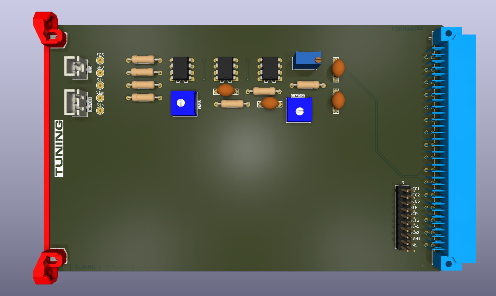
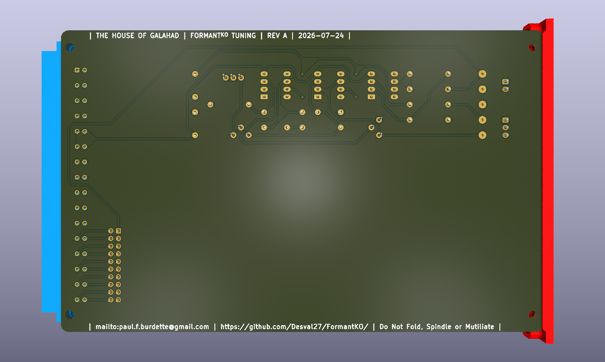

# TUNING

Format: 3U

The **Tuning Module** provides a stable and convenient pitch reference for calibrating the synthesizer. It generates a fixed reference tone and/or precision control voltage that allows VCOs to be adjusted for correct tuning, octave tracking, and consistency across the system. Rather than being used as part of a patch during performance, it serves as a workshop and maintenance tool, making oscillator calibration faster, more accurate, and repeatable after construction, repair, or periodic adjustment.

## Status

⚠️ Untested ⚠️

## Documents

- [English Translation](doc/TUNING__en.pdf)
- [Schematic](doc/schematic.pdf)
- [Assembly](doc/assembly.pdf)
- [Bill of Materials](doc/bom.csv)
- [Interactive Bill of Materials](doc/ibom.html)

## Gerber to Order

⚠️ Untested ⚠️

- [Default](gerber_to_order/TUNING_160.0x100.0mm_for_Default.zip)
- [Elecrow](gerber_to_order/TUNING_160.0x100.0mm_for_Elecrow.zip)
- [FusionPCB](gerber_to_order/TUNING_160.0x100.0mm_for_FusionPCB.zip)
- [JLCPCB](gerber_to_order/TUNING_160.0x100.0mm_for_JLCPCB.zip)
- [PCBWay](gerber_to_order/TUNING_160.0x100.0mm_for_PCBWay.zip)

## Images

