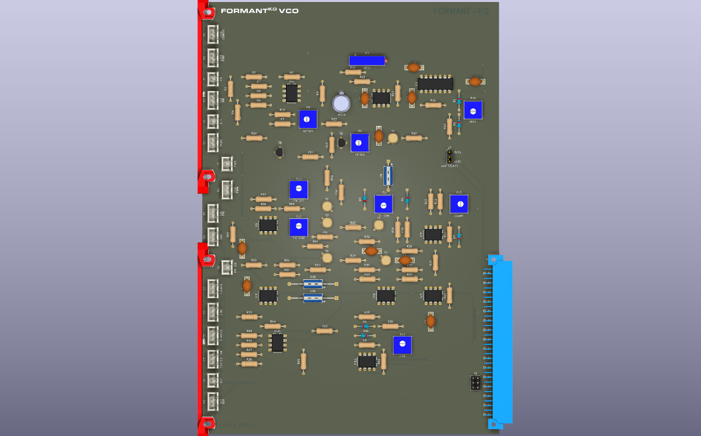
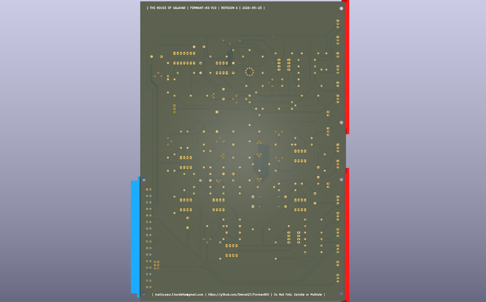

# VCO

## Status

⚠️ Incomplete⚠️

## Documents

- [Schematic](schematic.pdf)
- [Assembly](plots/VCO__Assembly.pdf)
- [Interactive Bill of Materials](bom/ibom.html)

## Gerber to Order

⚠️ Untested⚠️

- [Default](gerber_to_order/VCO_160.0x233.35mm_for_Default.zip)
- [Elecrow](gerber_to_order/VCO_160.0x233.35mm_for_Elecrow.zip)
- [FusionPCB](gerber_to_order/VCO_160.0x233.35mm_for_FusionPCB.zip)
- [JLCPCB](gerber_to_order/VCO_160.0x233.35mm_for_JLCPCB.zip)
- [PCBWay](gerber_to_order/VCO_160.0x233.35mm_for_PCBWay.zip)

## Images

