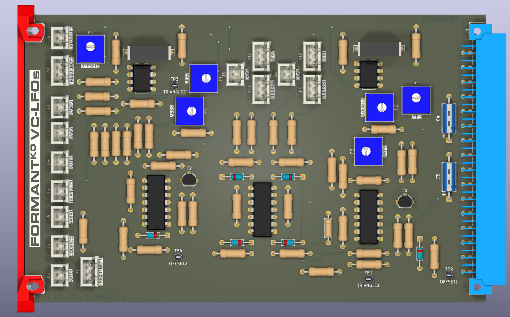
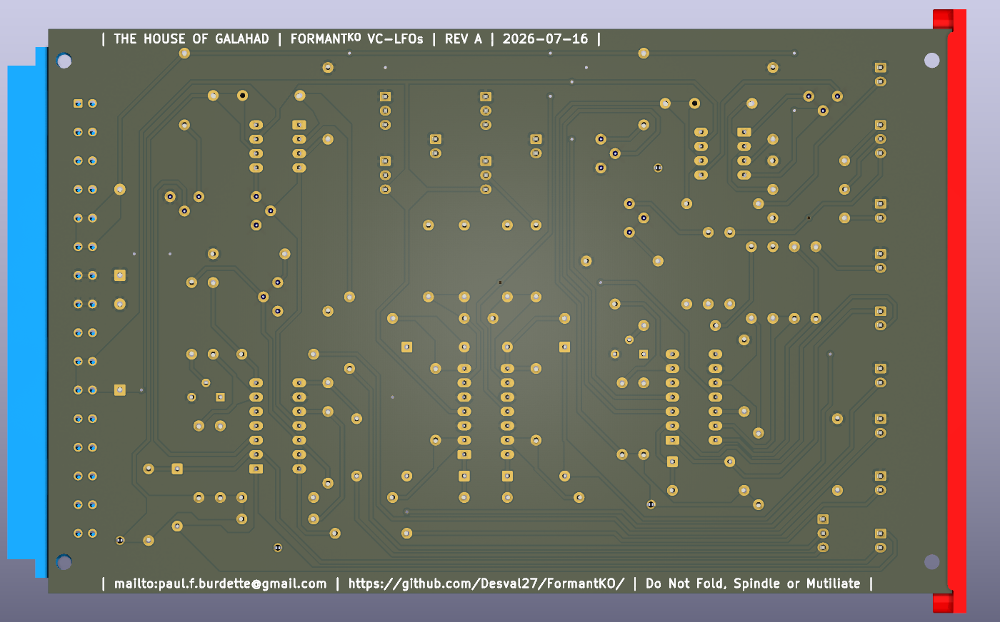

# VC-LFOs

Format: 3U

## Status

⚠️ Untested⚠️

## Documents

- [English Translated Document](VC_LFOs__en.pdf)
- [Schematic](plots/VC_LFOs__Schematic.pdf)
- [Assembly](plots/VC_LFOs__Assembly.pdf)
- [Interactive Bill of Materials](bom/ibom.html)

## Gerber to Order

⚠️ Untested⚠️

- [Default](gerber_to_order/VC_LFOs_160.0x100.0mm_for_Default.zip)
- [Elecrow](gerber_to_order/VC_LFOs_160.0x100.0mm_for_Elecrow.zip)
- [FusionPCB](gerber_to_order/VC_LFOs_160.0x100.0mm_for_FusionPCB.zip)
- [JLCPCB](gerber_to_order/VC_LFOs_160.0x100.0mm_for_JLCPCB.zip)
- [PCBWay](gerber_to_order/VC_LFOs_160.0x100.0mm_for_PCBWay.zip)

## Images

