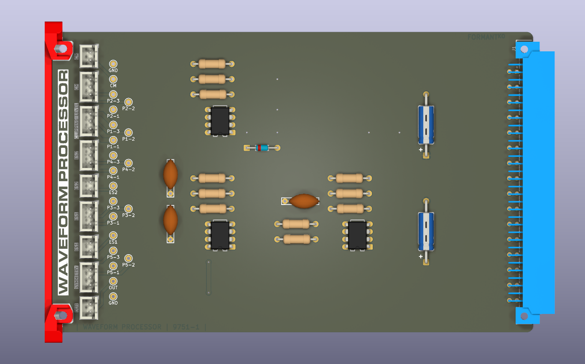
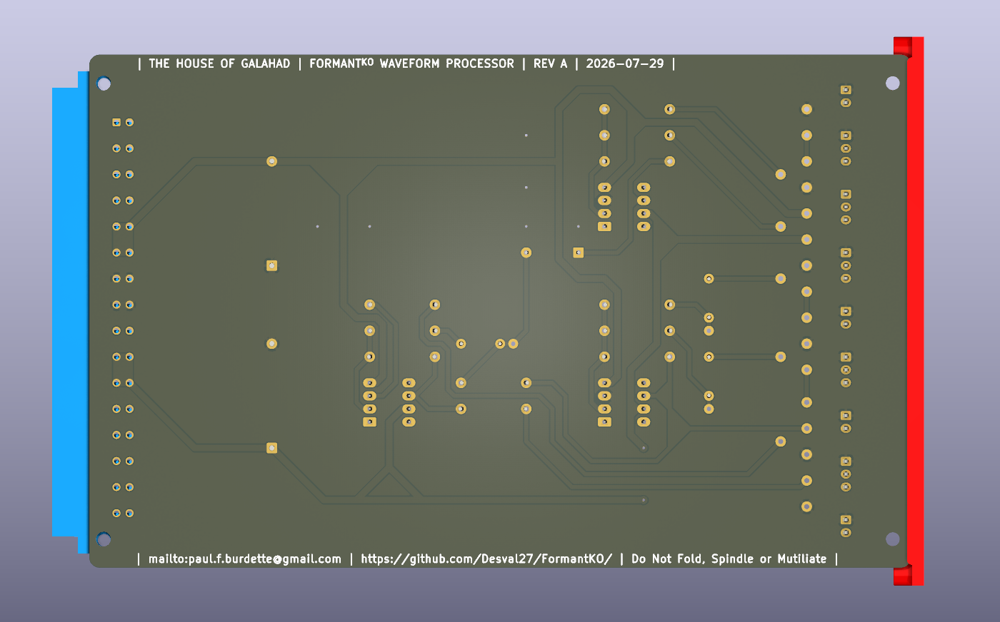

# WAVEFORM PROCESSOR

Format: 3U

The #Waveform Processor# (WP) is a versatile waveshaping module that dramatically expands the sonic palette of the FORMANT synthesizer by transforming existing oscillator waveforms into entirely new timbres. Using adjustable and voltage-controlled clipping, symmetry control, and selective amplification and inversion of waveform segments, it can produce effects ranging from brighter harmonics and trapezoidal waveforms to emphasized overtones, frequency doubling, and ring-modulator-like textures. With two signal inputs and a CV input for clipping modulation, the module responds dynamically to LFOs, envelopes, sequencers, or audio-rate control signals, making it equally suited for subtle animated timbral movement and aggressive experimental sound design. No calibration is required, making it a straightforward yet highly rewarding addition to any FORMANT system.

## Status

⚠️ Untested⚠️

## Documents

- [English Translation](doc/WAVEFORM_PROCESSOR__en.pdf)
- [Schematic](doc/schematic.pdf)
- [Assembly](doc/assembly.pdf)
- [Bill of Materials](doc/bom.csv)
- [Interactive Bill of Materials](doc/ibom.html)

## Gerber to Order

⚠️ Untested ⚠️

- [Default](gerber_to_order/WAVEFORM_PROCESSOR_160.0x100.0mm_for_Default.zip)
- [Elecrow](gerber_to_order/WAVEFORM_PROCESSOR_160.0x100.0mm_for_Elecrow.zip)
- [FusionPCB](gerber_to_order/WAVEFORM_PROCESSOR_160.0x100.0mm_for_FusionPCB.zip)
- [JLCPCB](gerber_to_order/WAVEFORM_PROCESSOR_160.0x100.0mm_for_JLCPCB.zip)
- [PCBWay](gerber_to_order/WAVEFORM_PROCESSOR_160.0x100.0mm_for_PCBWay.zip)

## Images

