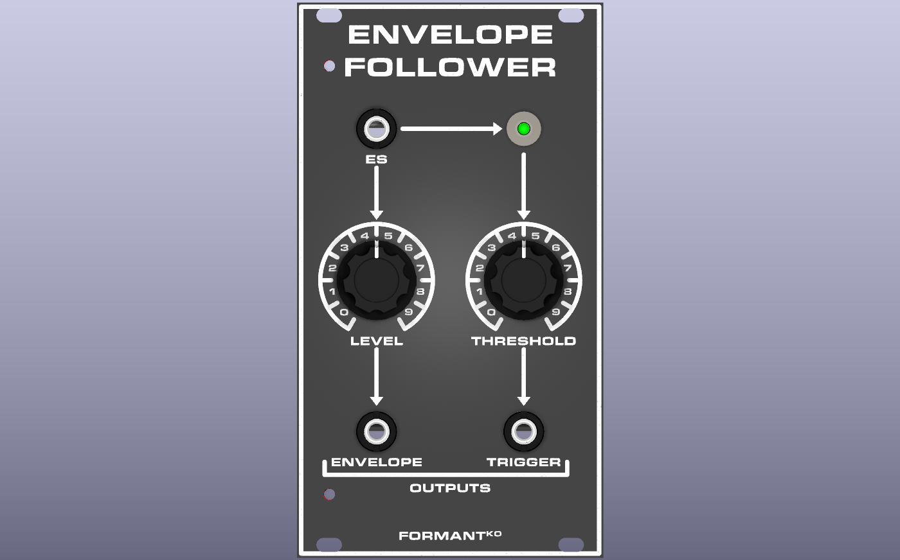
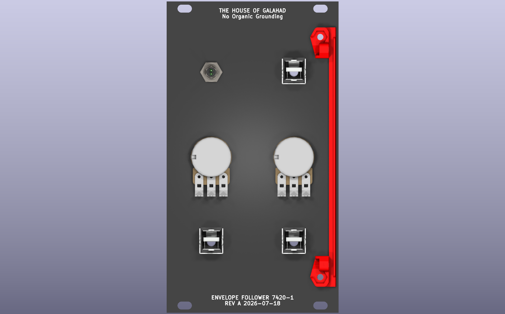

# ENVELOPE FOLLOWER

Formant: 3U

### Modifications

None

## Status

⚠️ Untested⚠️

## Gerber to Order

⚠️ Untested⚠️

- [Default](gerber_to_order/ENVELOPE_FOLLOWER_70.78x128.4mm_for_Default.zip)
- [Elecrow](gerber_to_order/ENVELOPE_FOLLOWER_70.78x128.4mm_for_Elecrow.zip)
- [FusionPCB](gerber_to_order/ENVELOPE_FOLLOWER_70.78x128.4mm_for_FusionPCB.zip)
- [JLCPCB](gerber_to_order/ENVELOPE_FOLLOWER_70.78x128.4mm_for_JLCPCB.zip)
- [PCBWay](gerber_to_order/ENVELOPE_FOLLOWER_70.78x128.4mm_for_PCBWay.zip)

## Images

