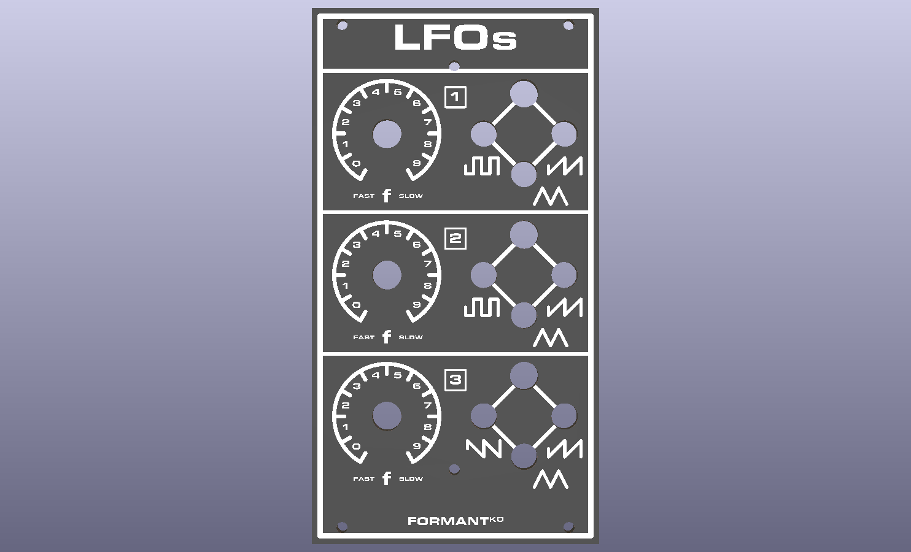

# TEMPLATE 3U

## Status

10% Complete

- [x] PCB Placement
- [ ] PCB Review
- [ ] Sample
- [ ] Build
- [ ] Tested

## Documents

- [Assembly](plots/LFOs_3U__Assembly.pdf)

## Gerber To Order

⚠️ Untested⚠️

- [Default](LFOs_71.0x132.5mm_for_Default.zip)
- [Elecrow](LFOs_71.0x132.5mm_for_Elecrow.zip)
- [FusionPCB](LFOs_71.0x132.5mm_for_FusionPCB.zip)
- [JLCPCB](LFOs_71.0x132.5mm_for_JLCPCB.zip)
- [PCBWay](LFOs_71.0x132.5mm_for_PCBWay.zip)

## Images

