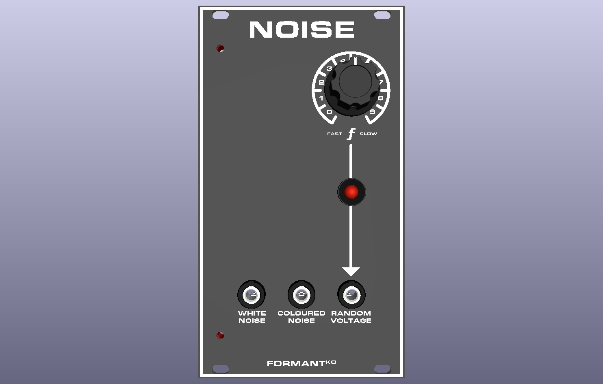
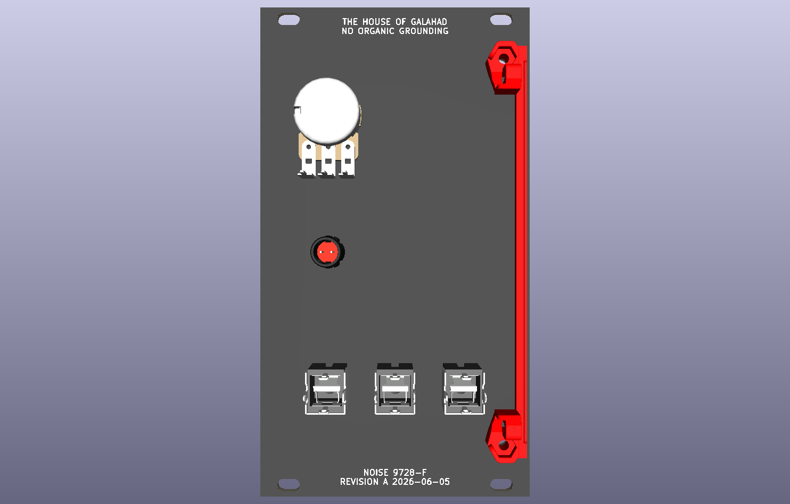

# NOISE

## Status

Incomplete

## Documents

- [Assembly](plots/NOISE__Assembly.pdf)

## Gerber To Order

⚠️ Untested⚠️

- [Default](NOISE_71.0x132.5mm_for_Default.zip)
- [Elecrow](NOISE_71.0x132.5mm_for_Elecrow.zip)
- [FusionPCB](NOISE_71.0x132.5mm_for_FusionPCB.zip)
- [JLCPCB](NOISE_71.0x132.5mm_for_JLCPCB.zip)
- [PCBWay](NOISE_71.0x132.5mm_for_PCBWay.zip)

## Images

