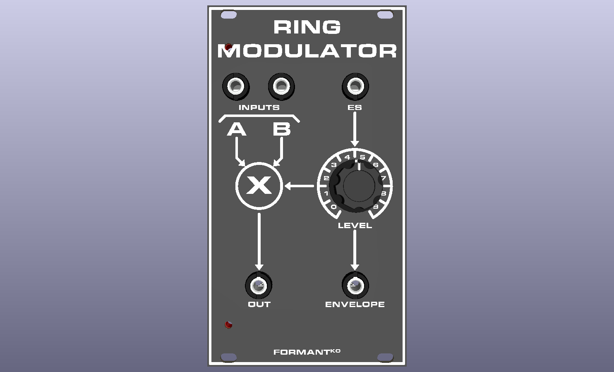
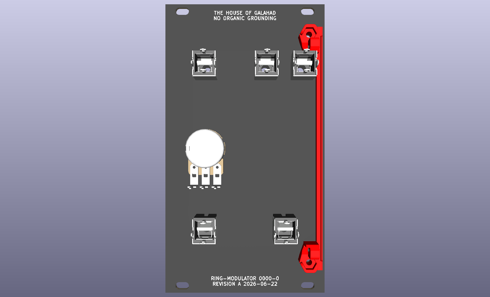

# RING-MODULATOR

## Status

⚠️Incomplete⚠️

## Documents

- [Assembly](plots/RING_MODULATOR__Assembly.pdf)

## Gerber To Order

- [Default](gerber_to_order/RING_MODULATOR_70.78x128.4mm_for_Default.zip)
- [Elecrow](gerber_to_order/RING_MODULATOR_70.78x128.4mm_for_Elecrow.zip)
- [FusionPCB](gerber_to_order/RING_MODULATOR_70.78x128.4mm_for_FusionPCB.zip)
- [JLCPCB](gerber_to_order/RING_MODULATOR_70.78x128.4mm_for_JLCPCB.zip)
- [PCBWay](gerber_to_order/RING_MODULATOR_70.78x128.4mm_for_PCBWay.zip)

⚠️Untested⚠️

## Images

