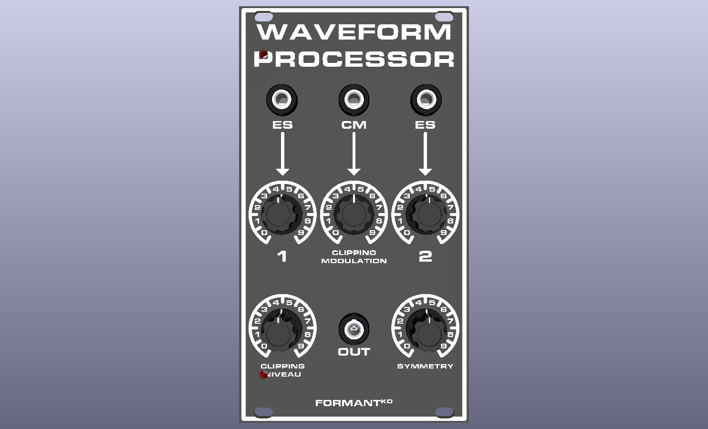

# WAVEFORM-PROCESOR

## Status

20% Complete

- [x] PCB Placement
- [x] PCB Review
- [ ] Sample
- [ ] Build
- [ ] Tested

## Documents

- [Assembly](plots/WAVEFORM_PROCESSOR__Assembly.pdf)

## Gerber To Order

⚠️ Untested⚠️

- [Default](WAVEFORM_PROCESSOR_71.0x132.5mm_for_Default.zip)
- [Elecrow](WAVEFORM_PROCESSOR_71.0x132.5mm_for_Elecrow.zip)
- [FusionPCB](WAVEFORM_PROCESSOR_71.0x132.5mm_for_FusionPCB.zip)
- [JLCPCB](WAVEFORM_PROCESSOR_71.0x132.5mm_for_JLCPCB.zip)
- [PCBWay](WAVEFORM_PROCESSOR_71.0x132.5mm_for_PCBWay.zip)

## Images

