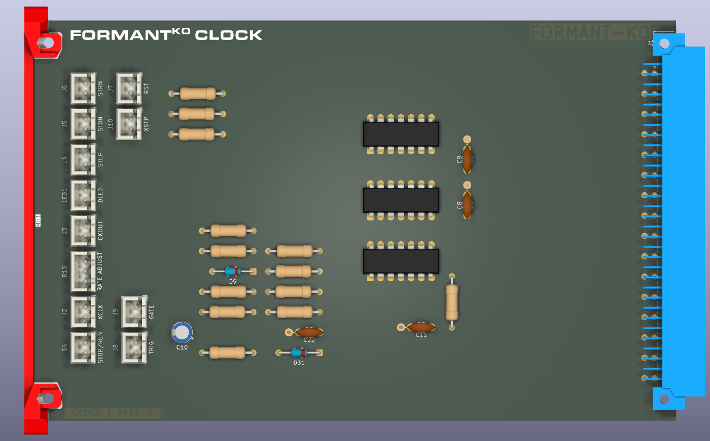
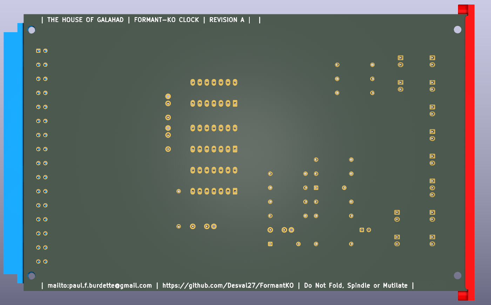

# CLOCK

## Status

⚠️ Incomplete⚠️

## Documents

<!--
- [Schematic](CLOCK.pdf)
- [Assembly](plots/CLOCK__Assembly.pdf)
- [Interactive Bill of Materials](bom/ibom.html)
-->

## Gerber to Order

⚠️ Untested⚠️

<!--
- [Default](gerber_to_order/CLOCK_160.0x100.0mm_for_Default.zip)
- [Elecrow](gerber_to_order/CLOCK_160.0x100.0mm_for_Elecrow.zip)
- [FusionPCB](gerber_to_order/CLOCK_160.0x100.0mm_for_FusionPCB.zip)
- [JLCPCB](gerber_to_order/CLOCK_160.0x100.0mm_for_JLCPCB.zip)
- [PCBWay](gerber_to_order/CLOCK_160.0x100.0mm_for_PCBWay.zip)
-->

## Images

