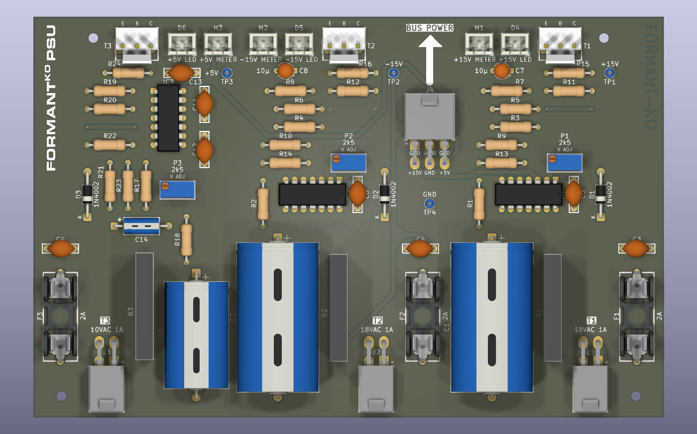
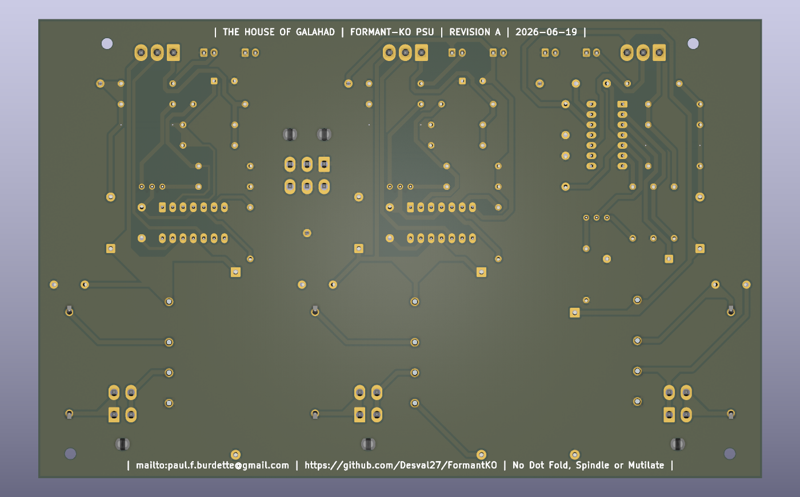

# POWER SUPPLY

The original Formant synthesizer uses a linear regulated split-rail power supply that provides **±15 V** for the analog circuitry and **+5 V** for digital logic and keyboard electronics. The design is built around mains transformers, bridge rectifiers, large smoothing capacitors, and linear voltage regulators, producing low-noise supply rails well suited for analog audio applications.

Unlike modern Eurorack systems, the Formant power supply was intended to power an entire cabinet of modules from a centralized supply, with power distributed via a backplane to each module. The generous ±15 V rails provide ample headroom for op-amp circuits, VCOs, VCFs, VCAs, and other analog building blocks.

There is a separate [PCB](PSU_PT/README.md) used for mounting the 2N3055 power transistors.

## Status

⚠️ Untested⚠️

## Additional Resources

- [POWER TRANSISTORS](PSU_PT/README.md)

## Documents

- [Schematic](plots/PSU__Schematic.pdf)
- [Assembly](plots/PSU__Assembly.pdf)
- [Bill of Materials](bom/bom.csv)
- [Interactive Bill of Materials](bom/ibom.html)

## Gerber to Order

⚠️ Untested⚠️

- [Default](gerber_to_order/PSU_177.800001x113.03mm_for_Default.zip)
- [Elecrow](gerber_to_order/PSU_177.800001x113.03mm_for_Elecrow.zip)
- [FusionPCB](gerber_to_order/PSU_177.800001x113.03mm_for_FusionPCB.zip)
- [JLCPCB](gerber_to_order/PSU_177.800001x113.03mm_for_JLCPCB.zip)
- [PCBWay](gerber_to_order/PSU_177.800001x113.03mm_for_PCBWay.zip)

## Images

