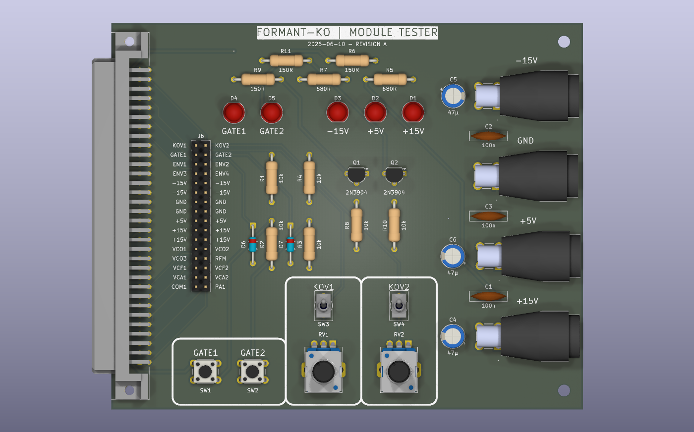
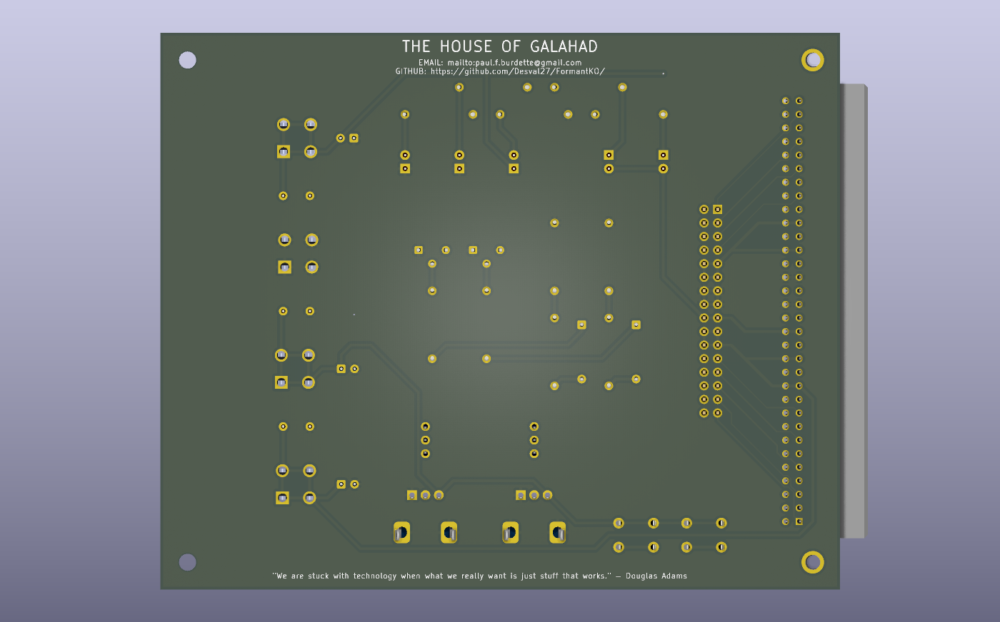

# MODULE TEST HARNESS

## STATUS

50% Complete

- [x] Schematic
- [x] Schematic Additions
- [x] Schematic Review
- [x] PCB Placement
- [x] PCB Routing
- [ ] PCB Review
- [ ] Sample
- [ ] Build
- [ ] Calibrated
- [ ] Tested

## Schematic

[Root](schematic.pdf)

## Interactive Bill of Materials

[iBOM](bom/ibom.html)

## Gerber to Order

- [Default](gerber_to_order/TEST_HARNESS_127.0x104.14mm_for_Default.zip)
- [Elecrow](gerber_to_order/TEST_HARNESS_127.0x104.14mm_for_Elecrow.zip)
- [FusionPCB](gerber_to_order/TEST_HARNESS_127.0x104.14mm_for_FusionPCB.zip)
- [JLCPCB](gerber_to_order/TEST_HARNESS_127.0x104.14mm_for_JLCPCB.zip)
- [PCBWay](gerber_to_order/TEST_HARNESS_127.0x104.14mm_for_PCBWay.zip)

## Images

