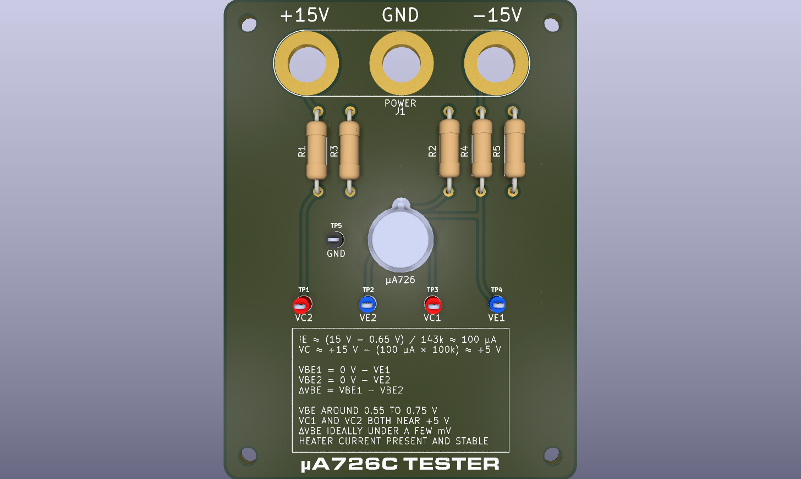
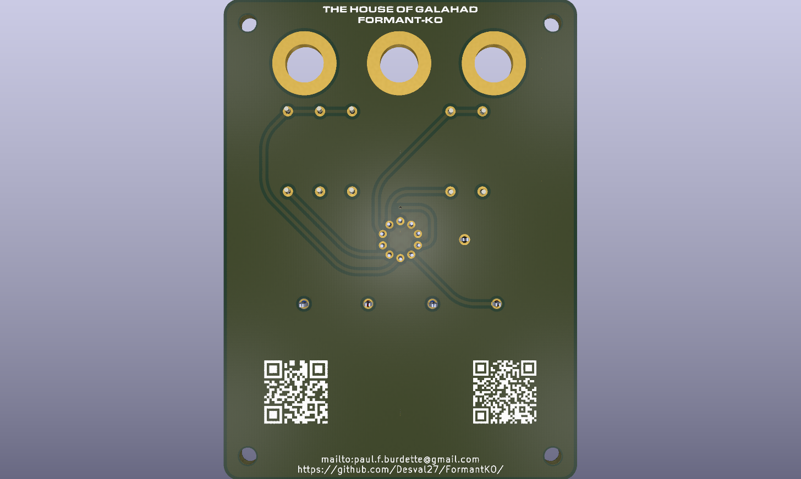

# uA726C TESTER

## STATUS

⚠️ Untested ⚠️

But possibly ready to get first samples...

## Documents

- [Schematic](schematic.pdf)
- [Assembly](plots/VALIDATOR_JIG__Assembly.pdf)
- [Interactive Bill of Materials](bom/ibom.html)

## Gerber to Order

⚠️ Untested ⚠️

- [Default](gerber_to_order/VALIDATOR_JIG_55.88x76.2mm_for_Default.zip)
- [Elecrow](gerber_to_order/VALIDATOR_JIG_55.88x76.2mm_for_Elecrow.zip)
- [FusionPCB](gerber_to_order/VALIDATOR_JIG_55.88x76.2mm_for_FusionPCB.zip)
- [JLCPCB](gerber_to_order/VALIDATOR_JIG_55.88x76.2mm_for_JLCPCB.zip)
- [PCBWay](gerber_to_order/VALIDATOR_JIG_55.88x76.2mm_for_PCBWay.zip)

## Images

